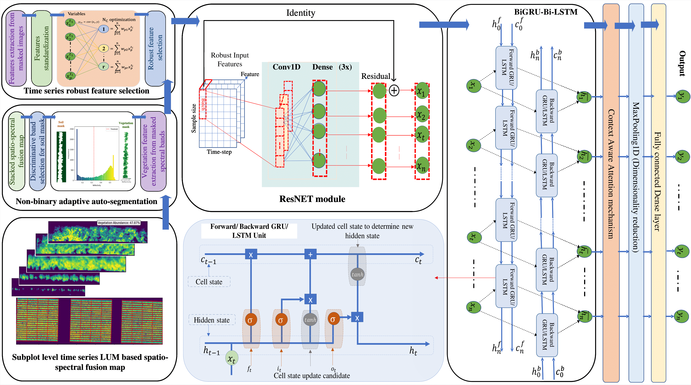

# 🌿 Context-Aware Deep Learning Model for Yield Prediction Using Time-Series UAS Multispectral Data

## 📖 About the Research
This reserach integrates **time-series uncrewed aerial system (UAS) multispectral imaging** with advanced **deep learning techniques** to enhance field-scale **crop yield prediction**. Using a **MicaSense RedEdge MX+ sensor**, multispectral data was collected across different nitrogen (N) rates throughout the potato growing season. The dataset was preprocessed and analyzed using a combination of **Partial Least Squares Regression (PLSR)** and a novel **deep learning architecture (CAR Conv1D-BiGRU-BiLSTM-Net)** to model temporal crop dynamics effectively.  

## 🏗 Research Pipeline  
The pipeline for **UAS-based crop yield prediction** follows a structured workflow:  



## 🚀 Features
- 🌍 **Multispectral UAS data analysis** with Pix4Dmapper, QGIS, and linear unmixing techniqe.
- 📈 **Feature extraction** using PLSR for robust prediction   
- 📊 **Time-series crop yield prediction** using deep learning   
- 🔄 **Growth stage-based yield modeling** (T1-T5)  
- 🖥️ **Python-based implementation** with geopandas, rasterio, sklearn, TensorFlow & SciPy

## 📂 Dataset & Preprocessing  
- Data collected using **UAS multispectral imaging**  
- Preprocessing: **Pix4Dmapper, QGIS, Linear unmixing, and soil masking techniques**  
- Feature engineering: **Vegetation indices (SR, CHLGR, MARI, Vf), N-rate**

## 🧠 Deep Learning Model  
- **PLSR for feature extraction** relevant to crop yield  
- **CAR Conv1D-BiGRU-BiLSTM-Net** for time-series prediction  
- **Outperformed other models** with **R² = 0.775** and **RMSE = 16.4%** 

## 🛠 Installation  
1. Clone the repository:  
   ```bash
   git clone https://github.com/SAY70/CAR-CNN-BiRNN.git
   cd CAR-CNN-BiRNN
   ```

## 📖 Citation
@article{yadav2025context,\
  title={Context-Aware Deep Learning Model for Yield Prediction in Potato Using Time-Series UAS Multispectral Data},\
  author={Yadav, Suraj A and Zhang, Xin and Wijewardane, Nuwan K and Feldman, Max and Qin, Ruijun and Huang, Yanbo and Samiappan, Sathishkumar and Young, Wyatt and Tapia, Francisco G},\
  journal={IEEE Journal of Selected Topics in Applied Earth Observations and Remote Sensing},\
  year={2025},\
  publisher={IEEE}\
}


## 🤝 Contributing
We welcome contributions! Feel free to submit pull requests or open issues.

---
🌟 **Star this repository** if you find it useful!


